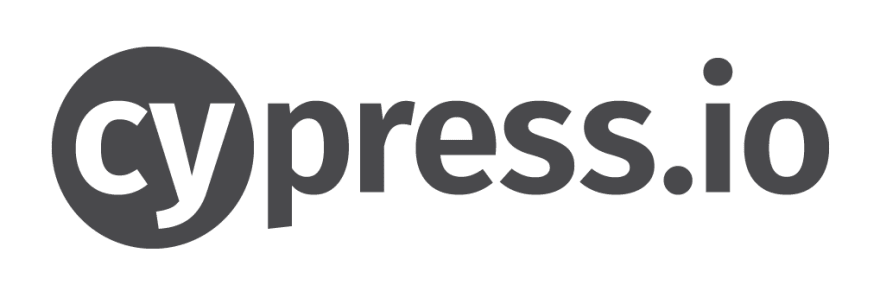

## Hi 👋, I'm a Software QA Engineer working in Dhaka, Bangladesh

  
  
  
  

#### Now

- ✨ Contributing to [Quality Assuring at Infolytx](https://www.infolytx.com/);
- :fire: Interested in TestSecOps;
- :calendar: Looking for contributing to java script based open source projects 

#### Bio

- 🏢 I'm currently working at **Infolytx Bangladesh Ltd**
- ⚙️ I use daily: `.py`, `.js`, `.yml`, `.sh`
- 🌍 I'm mostly active within the **Python Community**
- 🌱 Learning all about **DevOps**
- 💬 Ping me about **WebdriverIO**, **Cypress**, **Playwright**, **Postman**
- 📫 Reach me: [twitter.com/ra_cse](https://twitter.com/ra_cse)
- 📝 Checkout my [Resume](files/SQA_6_University_Of_Wales_Rakib.pdf).

#### My Current Stack

        

#### Development Stuffs:

<b>⚡ Github Stats</b>

 

#### Connect With Me

 
 

